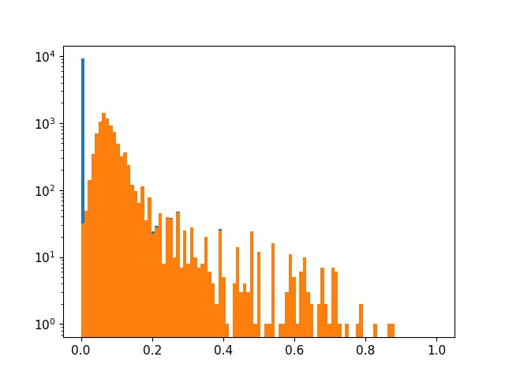
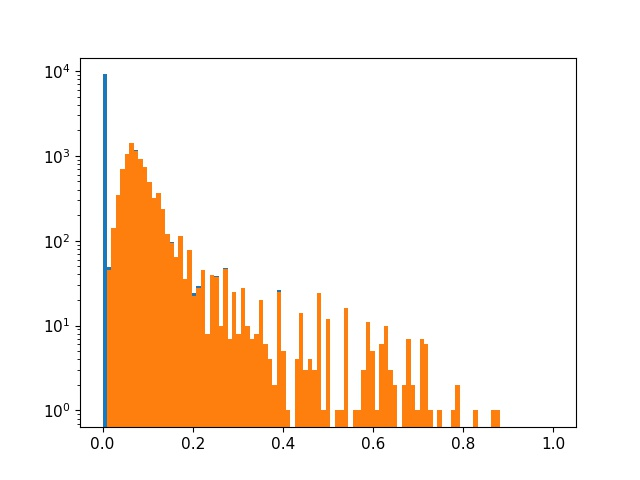

# yolov5-pruning-distillation
channel pruning and distillation for yolov5 (applied to android)

## Background
yolov5s的计算量和参数量分别为8.39G和7.07M。部署在android上的推理速度差不多300ms了。本项目主要从模型端入手，通过替换backbone(mobilenetv2)，通道剪枝对模型进行压缩。
利用yolov5x对剪枝后的模型进行蒸馏finetune。

## Baseline
数据集采用Pascal VOC，trainset = train2007+train2012+val2007+val2012，testset = test2007，Baseline采用mobile-yolo（imagenet预训练）  
如果未经特殊说明则均为使用默认参数，batchsize=40，epoch=50，train_size = 320-640，test_size = 640 
PS. 由于资源有限，此项目训练并不饱和，map并不是最高状态。但是可以通过控制相同的超参数来进行实验对比，所以并不影响最终结果。

## Pruning
1. 输出层不动，统计其他所有BN层的weight分布
2. 根据稀疏率决定剪枝阈值
3. 开始剪枝，如果当前层所有值均小于阈值则保留最大的一个通道(保证结构不被破坏)

|Model|Precision|Recall|mAP|ex-epoch|sl|Prune_prob|Params(M)|Flops(G)|
|----|----|----|----|----|----|----|----|----|
|Baseline|0.325|0.813|0.666|-|-|-|2.62|3.6|
|Baseline|0.323|0.795|0.655|-|5e-4|-|2.62|3.6|
|Baseline|0.291|0.76|0.593|-|1e-3|-|2.62|3.6|
|Pruning 1|0.287|0.736|0.558|10|1e-3|0.5|1.34|2.37|
|Pruning 1|0.297|0.736|0.559|10|1e-3|thres=0.01|1.32|2.34|
|Pruning 1|0.314|0.74|0.58|20|1e-3|thres=0.01|1.32|2.34|

### Pruning Experiment
1. 先从头训练一个baseline，以及训练一个对bn中gamma参数加入L1正则化的网络。稀疏参数分别为sl=5e-4和sl=1e-3。
当sl较小的时候，map几乎和baseline相同，但是bn的分布仍然不稀疏。当sl调大之后，map掉了6个点，不过一半以上的gamma参数都趋向于0了。
2. 剪枝策略按照论文中的做法给定一个稀疏率，统计所有参与剪枝层的bn参数l1值并进行排序，依据稀疏率确定阈值。
3. 将所有小于阈值的层全部减掉，如果有依赖则将依赖的对应部分也剪掉。如果一层中所有的层都需要被移除，那么就保留最大的一层通道(保证网络结构) 

4. 将得到的网络finetune 10个epoch。map可以基本恢复上来，但是此处仍然还差3.5个点（可能训练次数不够）。
不过还可以看出一个问题，就是选的0.5稀疏率并没有把所有趋向于0的层剪掉。说明我们选的0.5不够好，这次我们不按照稀疏率来剪枝，而是给定一个非常小的值0.01。 

5. 再次finetune 10个epoch。map仍然是0.559，但是此时参数量更少（把所有趋于0的都cut了）。为了验证是否是finetune训练次数不够，此时尝试训练20个epoch，map果然上升到0.58。
（其实此时map还在上升。此处只是说明一下再训练一些可以达到baseline的水平）

## Reference
1. [https://github.com/ultralytics/yolov5](https://github.com/ultralytics/yolov5)
2. [https://github.com/VainF/Torch-Pruning](https://github.com/VainF/Torch-Pruning)

